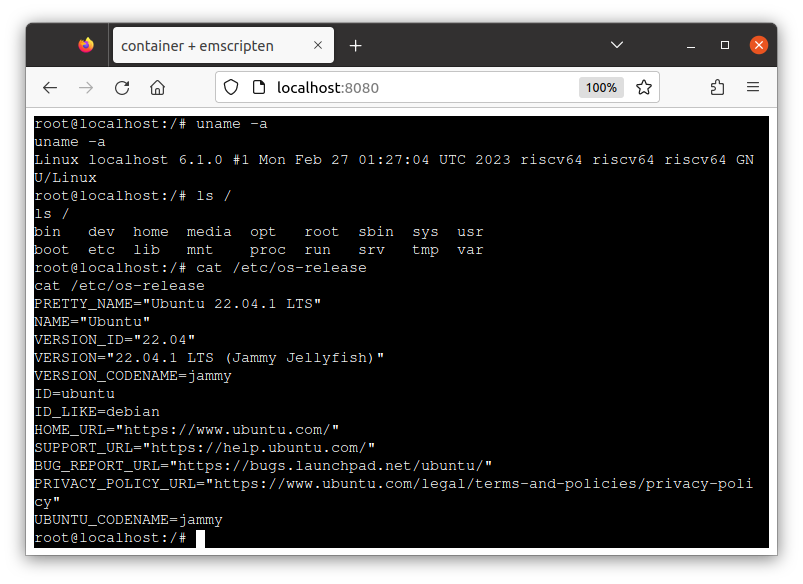

# container2wasm: Container to WASM converter

container2wasm is a container-to-wasm image converter that enables to run the container on WASM.

- Converts a container to WASM with TinyEMU-based emulation
- Runs on WASI runtimes (e.g. wasmtime, wamr, wasmer, wasmedge, wazero)
- Runs on browser
- riscv64 containers are recommended. Other platforms (e.g. amd64 and arm64) also work (but slow).

This is an experimental software.

## Examples

### Container Image to WASM (WASI)

```
$ c2w riscv64/ubuntu:22.04 out.wasm
```

The above command converts `riscv64/ubuntu:22.04` container image to WASI image (`out.wasm`).

> NOTE: riscv64 container is recommended. Other platform's containers should work but slow because of additional emulation.

The generated image runs on WASI runtimes:

```
$ wasmtime out.wasm uname -a
Linux localhost 6.1.0 #1 Wed Feb 15 04:09:09 UTC 2023 riscv64 riscv64 riscv64 GNU/Linux
$ wasmtime out.wasm ls /
bin   dev  home  media	opt   root  sbin  sys  usr
boot  etc  lib	 mnt	proc  run   srv   tmp  var
```

Directories on the host can be available on the container using `--mapdir`:

```
$ mkdir -p /tmp/share/ && echo hi > /tmp/share/hi
$ wasmtime --mapdir /test/dir/share::/tmp/share -- out.wasm --entrypoint=cat -- /test/dir/share/hi
hi
```

> NOTE: Other WASI features untested. Future version will support more WASI features.

### Container on Browser

The following command generates a WASM image and a JS file runnable on browser.

```
$ c2w --to-js riscv64/ubuntu:22.04 /tmp/out-js/htdocs/
```

The following is an example of running the image on browser relying on [xterm-pty](https://github.com/mame/xterm-pty).
This example serves the image on `localhost:8080` using apache http server.

```
$ cp -R ./examples/emscripten/* /tmp/out-js/ && chmod 755 /tmp/out-js/htdocs
$ docker run --rm -p 8080:80 \
         -v "/tmp/out-js/htdocs:/usr/local/apache2/htdocs/:ro" \
         -v "/tmp/out-js/xterm-pty.conf:/usr/local/apache2/conf/extra/xterm-pty.conf:ro" \
         --entrypoint=/bin/sh httpd -c 'echo "Include conf/extra/xterm-pty.conf" >> /usr/local/apache2/conf/httpd.conf && httpd-foreground'
```

You can run the container on browser via `localhost:8080`.



> This feature is currently for demo only.

## Getting Started

- requirements
  - Docker 18.09+ (w/ `DOCKER_BUILDKIT=1`)
  - [Docker Buildx](https://docs.docker.com/build/install-buildx/) v0.8+ (recommended) or `docker build` (w/ `DOCKER_BUILDKIT=1`)

You can install the converter command `c2w` using one of the following methods:

### Release binary

Binaries are available from https://github.com/ktock/container2wasm/releases
Extract the tarball and put the binary somewhere under `$PATH`.

### Building binary using make

Go 1.19+ is needed.

```
make
sudo make install
```

## Command reference

### c2w

Converts a container image into a WASM image and writes it to the specified path (default: `out.wasm` at the current directory).

Usage: `c2w [options] image-name [output file]`

- `image-name`: container image name (will be pulled from the registry if it doesn't exist in Docker)
- `[output file]`: path to the result WASM file.

Sub commands

- `help, h`: Shows a list of commands or help for one command

Options

- `--assets value`: Custom location of build assets.
- `--dockerfile value`: Custom location of Dockerfile (default: embedded to this command)
- `--builder value`: Bulider command to use (default: "docker")
- `--target-arch value`: target architecture of the source image to use (default: "riscv64")
- `--build-arg value`: Additional build arguments (please see Dockerfile for available build args)
- `--to-js`: output JS files runnable on the browsers using emscripten
- `--debug-image`: Enable debug print in the output image
- `--show-dockerfile`: Show default Dockerfile
- `--legacy`: Use "docker build" instead of buildx (no support for assets flag) (default:false)
- `--help, -h`: show help
- `--version, -v: `print the version

### Run-time flags for WASM image

You can specify run-time flags to the generated wasm image for configuring the execution (e.g. for changing command to run in the container).

Usage: `out.wasm [options] [COMMAND] [ARG...]`

- `[COMMAND] [ARG...]`: command to run in the container. (default: commands specified in the image config)

Options

- `-entrypoint <command>` : entrypoint command. (default: entrypoint specified in the image config)
- `-no-stdin` : disable stdin. (default: false)

Example:

The following changes the container's entrypoint to `echo` and pass `hello` to the arguments.

```
wasmtime -- /app/out.wasm --entrypoint=echo hello
```

### Directory mapping

Directories mapped to the WASM program is accessible on the container as well.

```
$ mkdir -p /tmp/share/ && echo hi > /tmp/share/hi
$ wasmtime --mapdir /test/dir/share::/tmp/share /app/out.wasm ls /test/dir/share/
hi
```

## Motivation

Though more and more programming languages start to support WASM, it's not easy to run the existing programs on WASM.
This sometimes requires re-implementing and re-compiling them and costs extra time for development.
This is a PoC converter tries to solve it by enabling running unmodified containers on WASM.

## How does it work

contaienr2wasm creates a WASM image that runs the container and the Linux kernel on the emulated CPU.

The following shows the techniqual details:

- Builder: [BuildKit](https://github.com/moby/buildkit) runs the conversion steps written in Dockerfile.
- Emulator: [TinyEMU](https://bellard.org/tinyemu/) emulates RISC-V CPU on WASM. It's compiled to WASM using [wasi-sdk](https://github.com/WebAssembly/wasi-sdk) (for WASI) and [emscripten](https://github.com/emscripten-core/emscripten) (for on-browser).
- Guest OS: Linux and [`riscv64/alpine`](https://hub.docker.com/r/riscv64/alpine/tags) run on the emulated RISC-V CPU. [runc](https://github.com/opencontainers/runc) starts the container. Non-RISC-V containers runs with additional emulation by QEMU installed via [`tonistiigi/binfmt`](https://github.com/tonistiigi/binfmt).
- Directory Mapping: WASI filesystem API makes host directories visible to TinyEMU. TinyEMU mounts them to the guest linux via virtio-9p.
- Packaging: [wasi-vfs](https://github.com/kateinoigakukun/wasi-vfs) (for WASI) and emscripten (for on-browser) are used for packaging the dependencies. The kernel is pre-booted during the build using [wizer](https://github.com/bytecodealliance/wizer/) to minimize the startup latency (for WASI only as of now).
- Security: The converted container runs in the sandboxed WASM (WASI) VM with the limited access to the host system.

## WASM Runtimes Integration Status

|runtime |stdio|mapdir|note|
|---|---|---|---|
|wasmtime|:heavy_check_mark:|:heavy_check_mark:||
|wamr(wasm-micro-runtime)|:heavy_check_mark:|:heavy_check_mark:||
|wazero|:construction: (stdin unsupported)|:heavy_check_mark:|non-blocking stdin doesn't seem to work|
|wasmer|:construction: (stdin unsupported)|:heavy_check_mark:|non-blocking stdin doesn't seem to work|
|wasmedge|:construction: (stdin unsupported)|:heavy_check_mark:|non-blocking stdin doesn't seem to work|

- :heavy_check_mark: : supported
- :construction: : WIP

- **NOTE**: WASI features other than above is untested (future version will support more features)

## Similar projects

There are several container runtimes support running WASM applications but they don't run containers on WASM.

- WASM on container runtimes
  - Docker+Wasm integration: https://docs.docker.com/desktop/wasm/
  - runwasi: https://github.com/containerd/runwasi
  - youki: https://github.com/containers/youki
  - crun: https://github.com/containers/crun
  - krustlet: https://github.com/krustlet/krustlet

There are emulators that support running linux on WASM but they don't support WASI.

- x86 on WASM
  - v86: https://github.com/copy/v86

- RISCV on WASM
  - TinyEMU: https://bellard.org/tinyemu/

## Additional Documents

- Examples (python, php, non-riscv64 image, etc.): [`./examples/`](./examples/)

## Acknowledgement

- container2wasi itself is licensed under Apache 2.0 but the generated WASM image will include third-pirty softwares:
  - TinyEMU + BBL patch: https://bellard.org/tinyemu/
    - contained in ([`./patches`](./patches)). TinyEMU is modified by our project for making it work with containers
  - BBL(riscv-pk): https://github.com/riscv-software-src/riscv-pk
  - Linux: https://github.com/torvalds/linux/
  - tini: https://github.com/krallin/tini
  - runc: https://github.com/opencontainers/runc

- Emscripten integration example relies on xterm-pty for IO management: https://github.com/mame/xterm-pty
