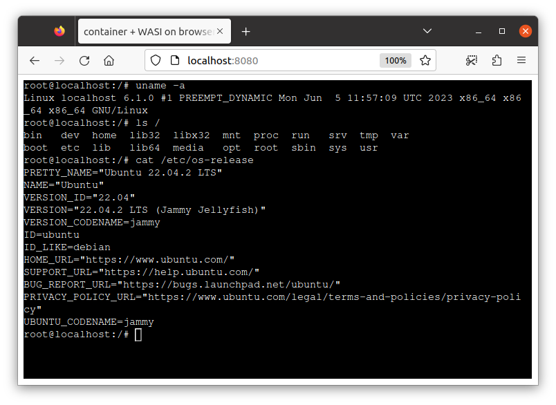

[[:arrow_down: **Download**]](https://github.com/ktock/container2wasm/releases)
[[:book: **Command reference**]](#command-reference)
[[:books: **Additional Documents**]](#additional-documents)
[[:arrow_forward: **Demo**]](https://ktock.github.io/container2wasm-demo/)

# container2wasm: Docker Container to WASM converter

container2wasm is a container-to-wasm image converter that enables to run the container on WASM.

- Converts a Docker container to WASM with emulation by Bochs (for x86_64 containers) and TinyEMU (for riscv64 containers).
- Runs on WASI runtimes (e.g. wasmtime, wamr, wasmer, wasmedge, wazero)
- Runs on browser
- x86_64 or riscv64 containers are recommended. Other platforms (e.g. arm64) also work (but slow).

This is an experimental software.

Demo page of containers on browser (debian,python,node,vim): https://ktock.github.io/container2wasm-demo/

## Examples

### Container Image to WASM (WASI)

```console
$ c2w ubuntu:22.04 out.wasm
```

The above command converts `ubuntu:22.04` container image to WASI image (`out.wasm`).

> NOTE1: For selecting the container image's architecture other than `amd64`, use `--target-arch` flag of c2w (e.g. `c2w --target-arch=riscv64 riscv64/ubuntu:22.04 out.wasm`).

> NOTE2: x86_64 or riscv64 container is recommended. Other platform's containers should work but slow because of additional emulation.

The generated image runs on WASI runtimes:

```console
$ wasmtime out.wasm uname -a
Linux localhost 6.1.0 #1 PREEMPT_DYNAMIC Mon Jun  5 11:57:09 UTC 2023 x86_64 x86_64 x86_64 GNU/Linux
$ wasmtime out.wasm ls /
bin   dev  home  lib32	libx32	mnt  proc  run	 srv  tmp  var
boot  etc  lib	 lib64	media	opt  root  sbin  sys  usr
```

Directory mapped from the host is accessible on the container.

```
$ mkdir -p /tmp/share/ && echo hi > /tmp/share/from-host
$ wasmtime --mapdir /mnt/share::/tmp/share out.wasm cat /mnt/share/from-host
hi
```

> Please refer to [`./examples/networking/wasi/`](./examples/networking/wasi/) for enabling networking

### Container on Browser



You can run the container on browser as well.
There are two methods for running the container on browser.

> Please also refer to [`./examples/wasi-browser`](./examples/wasi-browser/) (WASI-on-browser example) and [`./examples/emscripten`](./examples/emscripten/) (emscripten example).

> Please refer to [`./examples/networking/`](./examples/networking/) for details about enabling networking.

#### WASI on browser

This example converts the container to WASI and runs it on browser.

The following command generates a WASI image.

```
$ c2w ubuntu:22.04 /tmp/out-js2/htdocs/out.wasm
```

The following is an example of running the image on browser relying on [xterm-pty](https://github.com/mame/xterm-pty) and [browser_wasi_shim](https://github.com/bjorn3/browser_wasi_shim).
This example serves the image on `localhost:8080` using apache http server.

```
$ cp -R ./examples/wasi-browser/* /tmp/out-js2/ && chmod 755 /tmp/out-js2/htdocs
$ docker run --rm -p 8080:80 \
         -v "/tmp/out-js2/htdocs:/usr/local/apache2/htdocs/:ro" \
         -v "/tmp/out-js2/xterm-pty.conf:/usr/local/apache2/conf/extra/xterm-pty.conf:ro" \
         --entrypoint=/bin/sh httpd -c 'echo "Include conf/extra/xterm-pty.conf" >> /usr/local/apache2/conf/httpd.conf && httpd-foreground'
```

You can run the container on browser via `localhost:8080`.

##### WASI on browser with networking


Container can also perform networking.
This section is the demo of using curl command in the container.

> Tested only on Chrome. The example might not work on other browsers.

```
$ cat <<EOF | docker build -t debian-curl -
FROM debian:sid-slim
RUN apt-get update && apt-get install -y curl
EOF
$ c2w debian-curl /tmp/out-js2/htdocs/out.wasm
```

This example serves the image on `localhost:8080` using apache http server.
The following also puts the [network stack runnable on browser](./extras/c2w-net-proxy/) to the document root.

```
$ cp -R ./examples/wasi-browser/* /tmp/out-js2/ && chmod 755 /tmp/out-js2/htdocs
$ wget -O /tmp/out-js2/htdocs/c2w-net-proxy.wasm https://github.com/ktock/container2wasm/releases/download/v0.5.0/c2w-net-proxy.wasm
$ docker run --rm -p 8080:80 \
         -v "/tmp/out-js2/htdocs:/usr/local/apache2/htdocs/:ro" \
         -v "/tmp/out-js2/xterm-pty.conf:/usr/local/apache2/conf/extra/xterm-pty.conf:ro" \
         --entrypoint=/bin/sh httpd -c 'echo "Include conf/extra/xterm-pty.conf" >> /usr/local/apache2/conf/httpd.conf && httpd-foreground'
```

You can run the container on browser with several types of configurations:

- `localhost:8080/?net=browser`: Container with networking. [Network stack `c2w-net-proxy`](./extras/c2w-net-proxy/) implemented based on [`gvisor-tap-vsock`](https://github.com/containers/gvisor-tap-vsock) runs on browser and forwards HTTP/HTTPS packets using the browser's Fetch API. The set of accesible sites is restricted by the browser configuration (e.g. CORS restriction). See also [`./examples/networking/fetch`](./examples/networking/fetch/) for detalis.
- `localhost:8080/?net=delegate=ws://localhost:8888`: Container with networking. You need to run [user-space network stack `c2w-net`](./cmd/c2w-net/) implemented based on [`gvisor-tap-vsock`](https://github.com/containers/gvisor-tap-vsock) on the host (outside of browser). It forwards all packets received from the browser over WebSocket. See also [`./examples/networking/websocket`](./examples/networking/websocket/) for detalis and configuration. (tested only on Linux)
- `localhost:8080`: Container without networking.

#### emscripten on browser

This example uses emscripten for converting the container to WASM.

- pros: WASM image size can be smaller than WASI.
- cons: WASI-specific optimization like [Wizer](https://github.com/bytecodealliance/wizer/) pre-initialization isn't available for this mode. So the startup of the container can be slow (For x86_64 containers it might take >= 30s. For riscv64 containers it might take >= 10s).

The following command generates a WASM image and a JS file runnable on browser.

```console
$ c2w --to-js ubuntu:22.04 /tmp/out-js/htdocs/
```

The following is an example of running the image on browser relying on [xterm-pty](https://github.com/mame/xterm-pty).
This example serves the image on `localhost:8080` using apache http server.

```console
$ cp -R ./examples/emscripten/* /tmp/out-js/ && chmod 755 /tmp/out-js/htdocs
$ docker run --rm -p 8080:80 \
         -v "/tmp/out-js/htdocs:/usr/local/apache2/htdocs/:ro" \
         -v "/tmp/out-js/xterm-pty.conf:/usr/local/apache2/conf/extra/xterm-pty.conf:ro" \
         --entrypoint=/bin/sh httpd -c 'echo "Include conf/extra/xterm-pty.conf" >> /usr/local/apache2/conf/httpd.conf && httpd-foreground'
```

You can run the container on browser via `localhost:8080`.

> NOTE: It can take some time to load and start the container.

Networking can also be enabled using the [user-space network stack `c2w-net`](./cmd/c2w-net/) implemented based on [`gvisor-tap-vsock`](https://github.com/containers/gvisor-tap-vsock) serving over WebSocket on the host (outside of browser).
See also [`./examples/networking/websocket`](./examples/networking/websocket/) for detalis.

## Getting Started

- requirements
  - Docker 18.09+ (w/ `DOCKER_BUILDKIT=1`)
  - [Docker Buildx](https://docs.docker.com/build/install-buildx/) v0.8+ (recommended) or `docker build` (w/ `DOCKER_BUILDKIT=1`)

You can install the converter command `c2w` using one of the following methods.

> NOTE: The output binary also contains [`c2w-net`](./cmd/c2w-net/) which a command usable for controlling networking feature (please see also [./examples/networking](./examples/networking/) for details).

### Release binaries

Binaries are available from https://github.com/ktock/container2wasm/releases
Extract the tarball and put the binary somewhere under `$PATH`.

### Building binaries using make

Go 1.19+ is needed.

```
make
sudo make install
```

## Command reference

### c2w

Converts a container image into a WASM image and writes it to the specified path (default: `out.wasm` at the current directory).

Usage: `c2w [options] image-name [output file]`

- `image-name`: container image name (will be pulled from the registry if it doesn't exist in Docker)
- `[output file]`: path to the result WASM file.

Sub commands

- `help, h`: Shows a list of commands or help for one command

Options

- `--assets value`: Custom location of build assets.
- `--dockerfile value`: Custom location of Dockerfile (default: embedded to this command)
- `--builder value`: Bulider command to use (default: "docker")
- `--target-arch value`: target architecture of the source image to use (default: "amd64")
- `--build-arg value`: Additional build arguments (please see Dockerfile for available build args)
- `--to-js`: convert the container to WASM using emscripten
- `--debug-image`: Enable debug print in the output image
- `--show-dockerfile`: Show default Dockerfile
- `--legacy`: Use "docker build" instead of buildx (no support for assets flag) (default:false)
- `--help, -h`: show help
- `--version, -v: `print the version

### Run-time flags for WASM image

You can specify run-time flags to the generated wasm image for configuring the execution (e.g. for changing command to run in the container).

Usage: `out.wasm [options] [COMMAND] [ARG...]`

- `[COMMAND] [ARG...]`: command to run in the container. (default: commands specified in the image config)

Options

- `-entrypoint <command>` : entrypoint command. (default: entrypoint specified in the image config)
- `-no-stdin` : disable stdin. (default: false)

Example:

The following changes the container's entrypoint to `echo` and pass `hello` to the arguments.

```
wasmtime -- /app/out.wasm --entrypoint=echo hello
```

### Directory mapping

Directory mapped from the host is accessible on the container.

```
$ mkdir -p /tmp/share/ && echo hi > /tmp/share/hi
$ wasmtime --mapdir /test/dir/share::/tmp/share /app/out.wasm ls /test/dir/share/
hi
```

## Motivation

Though more and more programming languages start to support WASM, it's not easy to run the existing programs on WASM.
This sometimes requires re-implementing and re-compiling them and costs extra time for development.
This is a PoC converter tries to solve it by enabling running unmodified containers on WASM.

## How does it work

contaienr2wasm creates a WASM image that runs the container and the Linux kernel on the emulated CPU.

The following shows the techniqual details:

- Builder: [BuildKit](https://github.com/moby/buildkit) runs the conversion steps written in Dockerfile.
- Emulator: [Bochs](https://bochs.sourceforge.io/) emulates x86_64 CPU on WASM. [TinyEMU](https://bellard.org/tinyemu/) emulates RISC-V CPU on WASM. They're compiled to WASM using [wasi-sdk](https://github.com/WebAssembly/wasi-sdk) (for WASI and on-browser) and [emscripten](https://github.com/emscripten-core/emscripten) (for on-browser).
- Guest OS: Linux runs on the emulated CPU. [runc](https://github.com/opencontainers/runc) starts the container. Non-x86 and non-RISC-V containers runs with additional emulation by QEMU installed via [`tonistiigi/binfmt`](https://github.com/tonistiigi/binfmt).
- Directory Mapping: WASI filesystem API makes host directories visible to the emulator. Emulators mount them to the guest linux via virtio-9p.
- Packaging: [wasi-vfs](https://github.com/kateinoigakukun/wasi-vfs) (for WASI and on-browser) and emscripten (for on-browser) are used for packaging the dependencies. The kernel is pre-booted during the build using [wizer](https://github.com/bytecodealliance/wizer/) to minimize the startup latency (for WASI only as of now).
- Networking: Browser's Fetch API or WebSocket is used for on-browser image. `sock_*` API is used for WASI. [`gvisor-tap-vsock`](https://github.com/containers/gvisor-tap-vsock) can be used as the networking stack. (docs: [`./examples/networking/`](./examples/networking/))
- Security: The converted container runs in the sandboxed WASM (WASI) VM with the limited access to the host system.

## WASI Runtimes Integration Status

- :heavy_check_mark: : supported
- :construction: : WIP

- **NOTE**: WASI features not listed here are untested (future version will support more features)

### x86_64 containers

|runtime|stdio|mapdir|networking|note|
|---|---|---|---|---|
|wasmtime|:heavy_check_mark:|:heavy_check_mark:|:heavy_check_mark: (w/ [host-side network stack](./examples/networking/wasi/))||
|wamr(wasm-micro-runtime)|:heavy_check_mark:|:heavy_check_mark:|:construction:||
|wazero|:heavy_check_mark:|:heavy_check_mark:|:heavy_check_mark: (w/ [host-side network stack](./examples/networking/wasi/)||
|wasmer|:construction: (stdin unsupported)|:heavy_check_mark:|:construction:|non-blocking stdin doesn't seem to work|
|wasmedge|:construction: (stdin unsupported)|:heavy_check_mark:|:construction:|non-blocking stdin doesn't seem to work|

### risc-v and other architecutre's containers

|runtime |stdio|mapdir|networking|note|
|---|---|---|---|---|
|wasmtime|:heavy_check_mark:|:heavy_check_mark:|:heavy_check_mark: (w/ [host-side network stack](./examples/networking/wasi/))||
|wamr(wasm-micro-runtime)|:heavy_check_mark:|:heavy_check_mark:|:construction:||
|wazero|:heavy_check_mark:|:heavy_check_mark:|:heavy_check_mark: (w/ [host-side network stack](./examples/networking/wasi/))||
|wasmer|:construction: (stdin unsupported)|:heavy_check_mark:|:construction:|non-blocking stdin doesn't seem to work|
|wasmedge|:construction: (stdin unsupported)|:heavy_check_mark:|:construction:|non-blocking stdin doesn't seem to work|

## Similar projects

There are several container runtimes support running WASM applications, but they don't run containers on WASM.

- WASM on container runtimes
  - Docker+Wasm integration: https://docs.docker.com/desktop/wasm/
  - runwasi: https://github.com/containerd/runwasi
  - youki: https://github.com/containers/youki
  - crun: https://github.com/containers/crun
  - krustlet: https://github.com/krustlet/krustlet

There are emulators that support running linux on WASM, but they don't support WASI.

- x86 on WASM
  - v86: https://github.com/copy/v86

- RISCV on WASM
  - TinyEMU: https://bellard.org/tinyemu/

Some WASM API specs provides applications access to the host system.
Re-compilation (and possibe re-implementation) of the application is needed.

- WASI: https://github.com/WebAssembly/WASI
- WASIX(WASI + additional syscall extensions): https://github.com/wasix-org

## Additional Documents

- [`./examples/`](./examples): Examples (python, php, on-browser, networking, etc.)

## Acknowledgement

- container2wasi itself is licensed under Apache 2.0 but the generated WASM image will include third-pirty softwares:
  - Bochs ([GNU Lesser General Public License v2.1](https://github.com/bochs-emu/Bochs/blob/master/LICENSE)) https://bochs.sourceforge.io/
    - Source code is contained in ([`./patches/bochs`](./patches/bochs)). Bochs is modified by our project for making it work with containers
  - TinyEMU ([MIT License](https://opensource.org/license/mit/)) https://bellard.org/tinyemu/
    - Source code is contained in ([`./patches/tinyemu`](./patches/tinyemu)). TinyEMU is modified by our project for making it work with containers
  - GRUB ([GNU General Public License Version 3](https://www.gnu.org/licenses/gpl.html)): https://www.gnu.org/software/grub/
  - BBL(riscv-pk) ([license](https://github.com/riscv-software-src/riscv-pk/blob/master/LICENSE)): https://github.com/riscv-software-src/riscv-pk
  - Linux ([GNU General Public License version 2](https://github.com/torvalds/linux/blob/master/COPYING)): https://github.com/torvalds/linux/
  - tini ([MIT License](https://github.com/krallin/tini/blob/master/LICENSE)): https://github.com/krallin/tini
  - runc ([Apache License 2.0](https://github.com/opencontainers/runc/blob/main/LICENSE)): https://github.com/opencontainers/runc
  - Binfmt ([MIT License](https://github.com/tonistiigi/binfmt/blob/master/LICENSE)): https://github.com/tonistiigi/binfmt
  - QEMU ([license](https://github.com/qemu/qemu/blob/master/LICENSE)): https://github.com/qemu/qemu
  - vmtouch ([license](https://github.com/hoytech/vmtouch/blob/master/LICENSE)): https://github.com/hoytech/vmtouch
  - BusyBox ([GNU General Public License version 2](https://www.busybox.net/license.html)): https://git.busybox.net/busybox

- On-browser example relies on the following softwares.
  - xterm-pty ([MIT License](https://github.com/mame/xterm-pty/blob/main/LICENSE.txt)): https://github.com/mame/xterm-pty
  - `browser_wasi_shim` (either of [MIT License](https://github.com/bjorn3/browser_wasi_shim/blob/main/LICENSE-MIT) and [Apache License 2.0](https://github.com/bjorn3/browser_wasi_shim/blob/main/LICENSE-APACHE)): https://github.com/bjorn3/browser_wasi_shim
  - `gvisor-tap-vsock` ([Apache License 2.0](https://github.com/containers/gvisor-tap-vsock/blob/main/LICENSE)): https://github.com/containers/gvisor-tap-vsock
