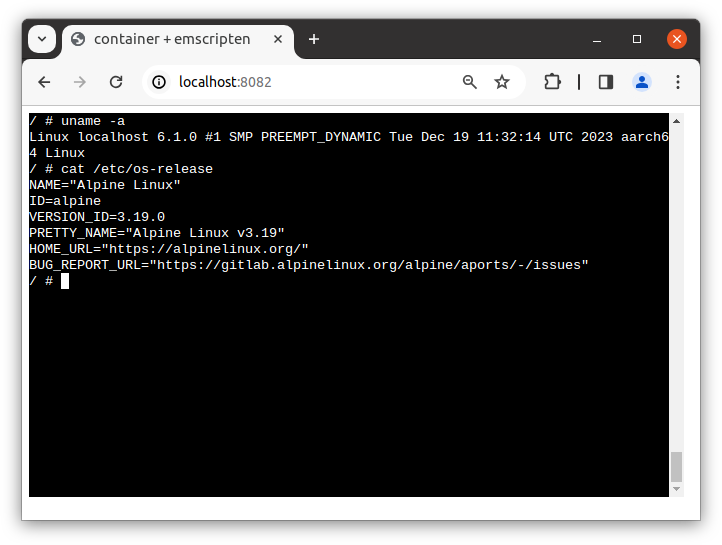

# AArch64 QEMU TCI on emscripten

Example: aarch64 alpine on emscripten

```
$ make
$ mkdir -p /tmp/out-js4/htdocs
$ ./out/c2w --assets=. --to-js --build-arg OPTIMIZATION_MODE=native --target-arch=aarch64 alpine:3.19 /tmp/out-js4/htdocs/
$ cp -R ./examples/emscripten-qemu-tci-aarch64/* /tmp/out-js4/
$ docker run --rm -p 8082:80 \
         -v "/tmp/out-js4/htdocs:/usr/local/apache2/htdocs/:ro" \
         -v "/tmp/out-js4/xterm-pty.conf:/usr/local/apache2/conf/extra/xterm-pty.conf:ro" \
         --entrypoint=/bin/sh httpd -c 'echo "Include conf/extra/xterm-pty.conf" >> /usr/local/apache2/conf/httpd.conf && httpd-foreground'
```

Then `localhost:8082` serves the image.

> NOTE: Booting the kernel and the containers is slow as of now. It takes several minutes with no output to the screen.


