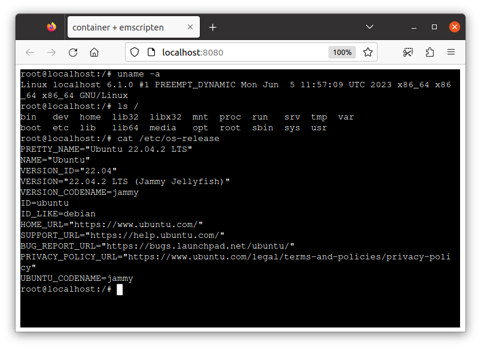

# Running container on browser with emscripten and xterm-pty

This is an example to run a container on browser using [emscripten](https://github.com/emscripten-core/emscripten).
Please refer to [README](../../README.md) for the usage of this example.

This example relies on [xterm-pty](https://github.com/mame/xterm-pty).
Please refer to [Emscripten integration](https://github.com/mame/xterm-pty#emscripten-integration) section on the xterm-pty's README for detail.

Instead of emscripten WASI image, you can also run [WASI](https://github.com/WebAssembly/WASI)-compiled image on browser, with leveraging WASI-specific performance optimization including pre-initialization by [Wizer](https://github.com/bytecodealliance/wizer/).
Please see [wasi-browser example](../wasi-browser) for details about WASI-on-browser.

Examples of enabling networking can be found at [`./../networking`](./../networking/).
