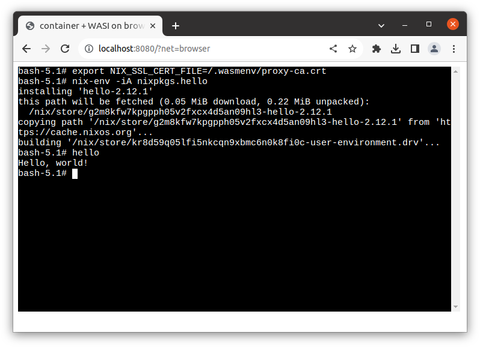

# Running container on browser with on-browser network stack based on Fetch API

This is an example of running a container on browser with networking support.

Please refer to [`../../wasi-browser`](../../wasi-browser/) for the basics of WASI-on-browser.

This example runs the container with network stack running on browser.
The entire network stack runs on browser so this doesn't require network stack daemon outside of browser.

- pros: No need to run network stack daemon on the host. Networking is done based on browser's Fetch API and follows its security configuration including CORS restriction.
- cons: Container can send only HTTP/HTTPS packets to outside of the browser. And the set of accesible HTTP/HTTPS sites is limited by the browser's security rule (e.g. limited CORS).

We provide the network stack [`c2w-net-proxy`](../../../extras/c2w-net-proxy) implemented based on [`gvisor-tap-vsock`](https://github.com/containers/gvisor-tap-vsock).
This is written in Go and compiled to WASM and runs on browser.

`c2w-net-proxy` running on browser provides HTTP/HTTPS proxy for the container.
The proxy runs on top of the network stack (running on browser) that receives packets from the container.
`c2w-net-proxy` forwards HTTP/HTTPS requests using the browser's `fetch` API so it doesn't require network stack daemon outside of the browser.

For HTTPS, the proxy teminates the TLS connection from the contaienr with its own certificate and re-encrypt the connection to the destination using the Fetch API.
So the proxy's certificate needs to be trusted by the processes in the container (`SSL_CERT_FILE` envvar is pre-configured).
In [our example JS wrapper for container](../../wasi-browser/), by defualt, the following well-known proxy-related envvars are configured and the proxy's certificate for HTTPS proxy is provided to `/.wasmenv/proxy.crt`.

- `SSL_CERT_FILE=/.wasmenv/proxy.crt`
- `https_proxy=http://192.168.127.253:80`
- `http_proxy=http://192.168.127.253:80`
- `HTTPS_PROXY=http://192.168.127.253:80`
- `HTTP_PROXY=http://192.168.127.253:80`

## Current limitations

- Containers can't access to sites not allowing CORS access. For example, we haven't find apt mirrors accessible from browser so the container can't run `apt-get`. We expect more sites will allow CORS access.
- The proxy supports only HTTP/HTTPS and the implementation isn't mature. So it's possible that some HTTP networking fails on some cases. We'll work on support for more features.
- The proxy and containers don't have the control over [Forbidden headers](https://developer.mozilla.org/en-US/docs/Glossary/Forbidden_header_name) that are controlled by the browser.
- Only chrome is our tested browser. The set of accesible sites might be different among browsers and the configurations.
- WASI-on-browser container is only supported. Emscripten support is the future work.

## Example1: curl

> Tested only on Chrome (116.0.5845.179). The example might not work on other browsers.


First, prepare a WASI image named `out.wasm`.

```
$ cat <<EOF | docker build -t debian-curl -
FROM debian:sid-slim
RUN apt-get update && apt-get install -y curl
EOF
$ c2w debian-curl /tmp/out-js2/htdocs/out.wasm
```

Then, put the WASM-compiled network stack (`c2w-net-proxy.wasm`) to `/tmp/out-js2/htdocs/`.
The WASM binary can be found at the [release page](https://github.com/ktock/container2wasm/releases).

```
$ wget -O /tmp/out-js2/htdocs/c2w-net-proxy.wasm https://github.com/ktock/container2wasm/releases/download/v0.5.0/c2w-net-proxy.wasm
```

> Alternatively, you can also build it as the following:
>
> NOTE: Run this at the project repo root directory. Go >= 1.21 is needed on your machine.
> 
> ```
> $ PREFIX=/tmp/out-js2/htdocs/ make c2w-net-proxy.wasm
> ```

Finally, serve them to browser.

> Run this at the project repo root directory.

```
$ cp -R ./examples/wasi-browser/* /tmp/out-js2/ && chmod 755 /tmp/out-js2/htdocs
$ docker run --rm -p 8080:80 \
         -v "/tmp/out-js2/htdocs:/usr/local/apache2/htdocs/:ro" \
         -v "/tmp/out-js2/xterm-pty.conf:/usr/local/apache2/conf/extra/xterm-pty.conf:ro" \
         --entrypoint=/bin/sh httpd -c 'echo "Include conf/extra/xterm-pty.conf" >> /usr/local/apache2/conf/httpd.conf && httpd-foreground'
```

You can run the container on browser via `localhost:8080/?net=browser`.

The proxy's certificate for HTTPS connection is available at `/.wasmenv/proxy.crt`.
This needs to be trusted to perform HTTPS proxy.
`SSL_CERT_FILE` is configured in the container by default.

The container can access to the sites allowed by the browser (e.g. CORS-enabled sites).
The example accesses to a site published via GitHub Pages (`curl https://ktock.github.io/container2wasm-demo/`).

## Example2: nix

> Tested only on Chrome (116.0.5845.179). The example might not work on other browsers.



Nix's binary cache (`https://cache.nixos.org/`) seems accessbile from browser.
So binaries available there can be installed and run on browser.

First, prepare a WASI image named `out.wasm` that contains `nixos/nix` image.

```
$ c2w nixos/nix /tmp/out-js2/htdocs/out.wasm
```

Then, put the WASM-compiled network stack (`c2w-net-proxy.wasm`) to `/tmp/out-js2/htdocs/`.
The WASM binary can be found at the [release page](https://github.com/ktock/container2wasm/releases).

```
$ wget -O /tmp/out-js2/htdocs/c2w-net-proxy.wasm https://github.com/ktock/container2wasm/releases/download/v0.5.0/c2w-net-proxy.wasm
```

> Alternatively, you can also build it as the following:
>
> NOTE: Run this at the project repo root directory. Go >= 1.21 is needed on your machine.
> 
> ```
> $ PREFIX=/tmp/out-js2/htdocs/ make c2w-net-proxy.wasm
> ```

Finally, serve them to browser.

> Run this at the project repo root directory.

```
$ cp -R ./examples/wasi-browser/* /tmp/out-js2/ && chmod 755 /tmp/out-js2/htdocs
$ docker run --rm -p 8080:80 \
         -v "/tmp/out-js2/htdocs:/usr/local/apache2/htdocs/:ro" \
         -v "/tmp/out-js2/xterm-pty.conf:/usr/local/apache2/conf/extra/xterm-pty.conf:ro" \
         --entrypoint=/bin/sh httpd -c 'echo "Include conf/extra/xterm-pty.conf" >> /usr/local/apache2/conf/httpd.conf && httpd-foreground'
```

You can run the container on browser via `localhost:8080/?net=browser`.
The proxy's certificate needs to be trusted by nix using `export NIX_SSL_CERT_FILE=/.wasmenv/proxy.crt`.

The example installs and runs `hello` package in the container (`nix-env -iA nixpkgs.hello`).

> It might takes several minutes to complete `nix-env`.
