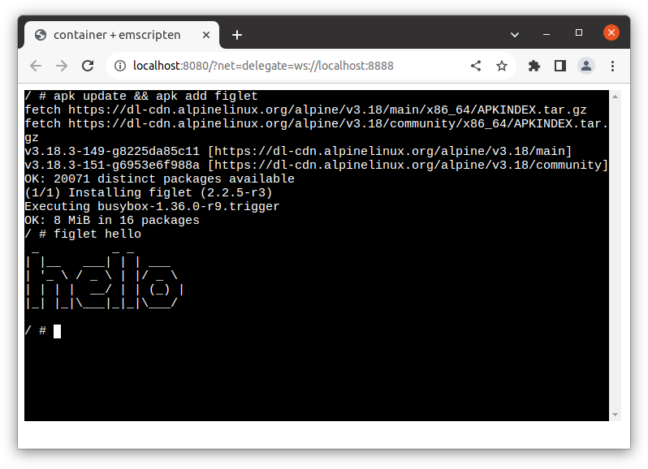

# Running container on browser with the network stack on the host accessible over WebSocket

This is an example of container on browser with networking support relying on the network stack on the host.

Please refer to [`../../wasi-browser`](../../wasi-browser/) for the basics of WASI-on-browser and [`../../emscripten`](../../emscripten/) for the basics of containers on emscripten.

This example relies on the network stack running on the host (outside of the browser) accessible via WebSocket.

> NOTE: Please see also [`../fetch`](../fetch/) for networking using on-browser network stack and Fetch API, without host-side daemon.

- pros: Container can access to anywhere accesible from the network stack daemon running on the host.
- cons:  The network stack daemon needs to run on the machine and forward packets received over WebSocket.

We provide [`c2w-net`](../../../cmd/c2w-net/) as the user-space network stack running on the host.
This is implemented based on [`gvisor-tap-vsock`](https://github.com/containers/gvisor-tap-vsock).

`c2w-net` exposes an WebSocket port and it forwards all packets received from that WebSocket.
The container running on browser can connect to that WebSocket and pass all packets there and let `c2w-net` forward them on the host.

> NOTE: This feature is tested only on Linux.

## Getting `c2w` and `c2w-net`

`c2w` and `c2w-net` are available on the [release page](https://github.com/ktock/container2wasm/releases).
You can also build them using `make` command:

```
$ make
```

## Example1: WASI-on-browser


The following builds and starts the network stack listening on the WebSocket `localhost:8888`.

```
$ c2w-net --listen-ws localhost:8888
```

Prepare a WASI image named `out.wasm`.

```
$ c2w alpine:3.18 /tmp/out-js2/htdocs/out.wasm
```

Then, serve it via browser.

> Run this at the project repo root directory.

```
$ cp -R ./examples/wasi-browser/* /tmp/out-js2/ && chmod 755 /tmp/out-js2/htdocs
$ docker run --rm -p 8080:80 \
         -v "/tmp/out-js2/htdocs:/usr/local/apache2/htdocs/:ro" \
         -v "/tmp/out-js2/xterm-pty.conf:/usr/local/apache2/conf/extra/xterm-pty.conf:ro" \
         --entrypoint=/bin/sh httpd -c 'echo "Include conf/extra/xterm-pty.conf" >> /usr/local/apache2/conf/httpd.conf && httpd-foreground'
```

You can run the container on browser via `localhost:8080/?net=delegate=ws://localhost:8888`.
The parameter `net=delegate` tells the [container's Javascript wrapper](../../wasi-browser/) to forward packets via the specified WebSocket address listened by `c2w-net`.

This example installs and runs `figlet` command in the container (`apk update && apk add figlet`).

> It might takes several minutes to complete `apk add`.

## Example2: emscripten



The following builds and starts the network stack listening on the WebSocket `localhost:8888`.

```
$ c2w-net --listen-ws localhost:8888
```

Prepare a WASI image named `out.wasm`.

```
$ c2w --to-js alpine:3.18 /tmp/out-js/htdocs/
```

Then, serve it via browser.

> Run this at the project repo root directory.

```
$ cp -R ./examples/emscripten/* /tmp/out-js/ && chmod 755 /tmp/out-js/htdocs
$ docker run --rm -p 8080:80 \
         -v "/tmp/out-js/htdocs:/usr/local/apache2/htdocs/:ro" \
         -v "/tmp/out-js/xterm-pty.conf:/usr/local/apache2/conf/extra/xterm-pty.conf:ro" \
         --entrypoint=/bin/sh httpd -c 'echo "Include conf/extra/xterm-pty.conf" >> /usr/local/apache2/conf/httpd.conf && httpd-foreground'
```

You can run the container on browser via `localhost:8080/?net=delegate=ws://localhost:8888`.
The parameter `net=delegate` tells the [container's Javascript wrapper](../../wasi-browser/) to forward packets via the specified WebSocket address listened by `c2w-net`.

This example installs and runs `figlet` command in the container (`apk update && apk add figlet`).

> It might takes several minutes to complete `apk add`.
