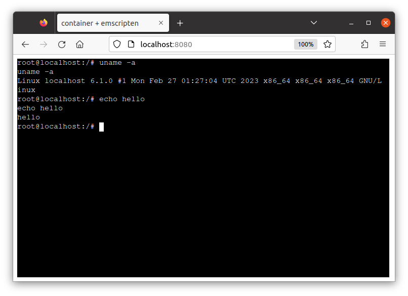

# Non-riscv64 image example

You can use `target-arch` flag to change the target architecture.

> NOTE: As of now, the non-riscv64 image is slow because it runs on the additional emulation by QEMU in the guest linux.

## Convert to WASI

```
$ c2w --target-arch=amd64 ubuntu:22.04 /tmp/out/out.wasm
```

Run it on the runtime:

```
$ wasmtime /tmp/out/out.wasm echo hello
hello
```

## Run on browser

```
$ c2w --to-js --target-arch=amd64 ubuntu:22.04 /tmp/amd64ubuntu/htdocs/
```

Run it on browser:

> Run this at the project repo root directory.

```
$ cp -R ./examples/emscripten/* /tmp/amd64ubuntu/ && chmod 755 /tmp/amd64ubuntu/htdocs
$ docker run --rm -p 8080:80 \
         -v "/tmp/amd64ubuntu/htdocs:/usr/local/apache2/htdocs/:ro" \
         -v "/tmp/amd64ubuntu/xterm-pty.conf:/usr/local/apache2/conf/extra/xterm-pty.conf:ro" \
         --entrypoint=/bin/sh httpd -c 'echo "Include conf/extra/xterm-pty.conf" >> /usr/local/apache2/conf/httpd.conf && httpd-foreground'
```


