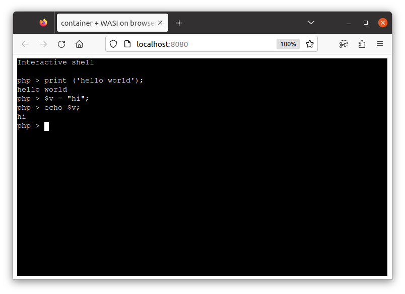

# php example (x86_64)



## Convert to WASI

Convert the php image to WASM

```
$ c2w php:8.1-cli-alpine3.16 /tmp/out/out.wasm
```

Run it on the runtime:

```
$ wasmtime -- /tmp/out/out.wasm -- -r 'print("hello world\n");'
hello world
```

This passes `-r 'print("hello world\n");'"` argument to `php` (entrypoint of this image) and `hello world` is printed.

## Run WASI image on browser

The following runs the WASI-converted container image on browser.

> Run this at the project repo root directory.

```
$ c2w php:8.1-cli-alpine3.16 /tmp/out-js2/htdocs/out.wasm
$ cp -R ./examples/wasi-browser/* /tmp/out-js2/ && chmod 755 /tmp/out-js2/htdocs
$ docker run --rm -p 8080:80 \
         -v "/tmp/out-js2/htdocs:/usr/local/apache2/htdocs/:ro" \
         -v "/tmp/out-js2/xterm-pty.conf:/usr/local/apache2/conf/extra/xterm-pty.conf:ro" \
         --entrypoint=/bin/sh httpd -c 'echo "Include conf/extra/xterm-pty.conf" >> /usr/local/apache2/conf/httpd.conf && httpd-foreground'
```

You can run the container on browser via `localhost:8080`.

PHP REPL will start on browser (you might need to wait a while untils the prompt is printed).

> Please see [wasi-browser example](../wasi-browser) for details about WASI-on-browser.

## Run on browser using emscripten

`--to-js` provides emscripten-compiled image runnable on browser.

```
$ c2w --to-js php:8.1-cli-alpine3.16 /tmp/out-js4/htdocs/
```

Run it on browser:

> Run this at the project repo root directory.

```
$ ( cd ./examples/emscripten/htdocs/ && npx webpack && cp -R index.html dist vendor/xterm.css /tmp/out-js4/htdocs/ )
$ wget -O /tmp/c2w-net-proxy.wasm https://github.com/ktock/container2wasm/releases/download/v0.5.0/c2w-net-proxy.wasm
$ cat /tmp/c2w-net-proxy.wasm | gzip > /tmp/out-js4/htdocs/c2w-net-proxy.wasm.gzip
$ cp ./examples/emscripten/xterm-pty.conf /tmp/out-js4/
$ docker run --rm -p 8080:80 \
         -v "/tmp/out-js4/htdocs:/usr/local/apache2/htdocs/:ro" \
         -v "/tmp/out-js4/xterm-pty.conf:/usr/local/apache2/conf/extra/xterm-pty.conf:ro" \
         --entrypoint=/bin/sh httpd -c 'echo "Include conf/extra/xterm-pty.conf" >> /usr/local/apache2/conf/httpd.conf && httpd-foreground'
```

You can run the container on browser via `localhost:8080`.

PHP REPL will start on browser (you might need to wait a while untils the prompt is printed).
