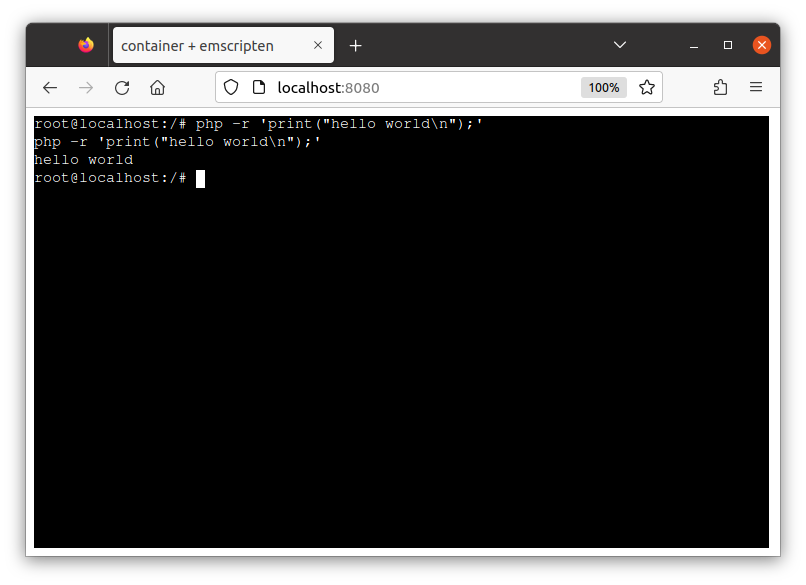

# php example

Build a riscv64 php image:

```console
$ cat <<EOF | docker buildx build -t php-ubuntu-riscv64 --platform=linux/riscv64 --load -
FROM riscv64/ubuntu:22.04
ENV DEBIAN_FRONTEND=noninteractive
RUN apt-get update && apt-get install -y php

ENTRYPOINT ["php"]
CMD ["-a"]
EOF
```

## Convert to WASI

Convert the image to WASM

```
$ c2w php-ubuntu-riscv64 /tmp/out/out.wasm
```

Run it on the runtime:

```
$ wasmtime -- /tmp/out/out.wasm -- -r 'print("hello world\n");'
hello world
```

This passes `-r 'print("hello world\n");'"` argument to `php` (`ENTRYPOINT` of this image) and `hello world` is printed.

## Run on browser

```
$ c2w --to-js --build-arg=EMSCRIPTEN_INITIAL_MEMORY=300MB php-ubuntu-riscv64 /tmp/phpjs/htdocs/
```

Run it on browser:

> Run this at the project repo root directory.

```
$ cp -R ./examples/emscripten/* /tmp/phpjs/ && chmod 755 /tmp/phpjs/htdocs
$ docker run --rm -p 8080:80 \
         -v "/tmp/phpjs/htdocs:/usr/local/apache2/htdocs/:ro" \
         -v "/tmp/phpjs/xterm-pty.conf:/usr/local/apache2/conf/extra/xterm-pty.conf:ro" \
         --entrypoint=/bin/sh httpd -c 'echo "Include conf/extra/xterm-pty.conf" >> /usr/local/apache2/conf/httpd.conf && httpd-foreground'
```

This runs the image on browser.
We specified `php` as the `ENTRYPOINT` with flag `-a` as `CMD` of this image so php REPL starts (you might need to wait a while untils the prompt is printed).


