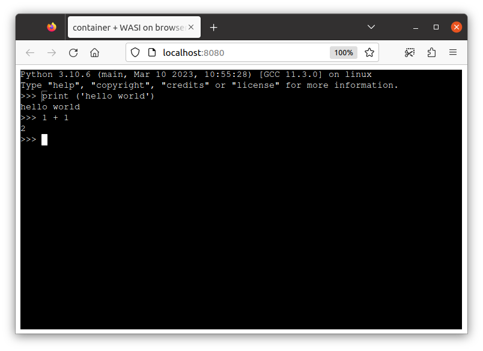

# python example (riscv64)



This example relies on [Docker Buildx](https://docs.docker.com/build/install-buildx/) v0.8+ with [multi-platform build](https://docs.docker.com/build/building/multi-platform/) configured.

Build a riscv64 python image:

```console
$ cat <<EOF | docker buildx build -t python-ubuntu-riscv64 --platform=linux/riscv64 --load -
FROM riscv64/ubuntu:22.04
RUN apt-get update && apt-get install -y python3
ENTRYPOINT ["python3"]
EOF
```

## Convert to WASI

Convert the image to WASM

```
$ c2w --target-arch=riscv64 python-ubuntu-riscv64 /tmp/out/out.wasm
```

Run it on the runtime:

```
$ wasmtime -- /tmp/out/out.wasm -- -c "print ('hello world')"
hello world
```

This passes `-c "print ('hello world')"` argument to `python3` (`ENTRYPOINT` of this image) and `hello world` is printed.

## Run WASI image on browser

The following runs the WASI-converted container image on browser.

> Run this at the project repo root directory.

```
$ c2w --target-arch=riscv64 python-ubuntu-riscv64 /tmp/out-js2/htdocs/out.wasm
$ cp -R ./examples/wasi-browser/* /tmp/out-js2/ && chmod 755 /tmp/out-js2/htdocs
$ docker run --rm -p 8080:80 \
         -v "/tmp/out-js2/htdocs:/usr/local/apache2/htdocs/:ro" \
         -v "/tmp/out-js2/xterm-pty.conf:/usr/local/apache2/conf/extra/xterm-pty.conf:ro" \
         --entrypoint=/bin/sh httpd -c 'echo "Include conf/extra/xterm-pty.conf" >> /usr/local/apache2/conf/httpd.conf && httpd-foreground'
```

You can run the container on browser via `localhost:8080`.

We specified `python3` as the `ENTRYPOINT` of this image so python REPL starts (you might need to wait a while untils the prompt is printed).

> Please see [wasi-browser example](../wasi-browser) for details about WASI-on-browser.

## Run on browser using emscripten

`--to-js` provides emscripten-compiled image runnable on browser.

```
$ c2w --to-js --target-arch=riscv64 python-ubuntu-riscv64 /tmp/pythonjs/htdocs/
```

Run it on browser:

> Run this at the project repo root directory.

```
$ cp -R ./examples/emscripten/* /tmp/pythonjs/ && chmod 755 /tmp/pythonjs/htdocs
$ docker run --rm -p 8080:80 \
         -v "/tmp/pythonjs/htdocs:/usr/local/apache2/htdocs/:ro" \
         -v "/tmp/pythonjs/xterm-pty.conf:/usr/local/apache2/conf/extra/xterm-pty.conf:ro" \
         --entrypoint=/bin/sh httpd -c 'echo "Include conf/extra/xterm-pty.conf" >> /usr/local/apache2/conf/httpd.conf && httpd-foreground'
```

You can run the container on browser via `localhost:8080`.

We specified `python3` as the `ENTRYPOINT` of this image so python REPL starts (you might need to wait a while untils the prompt is printed).
