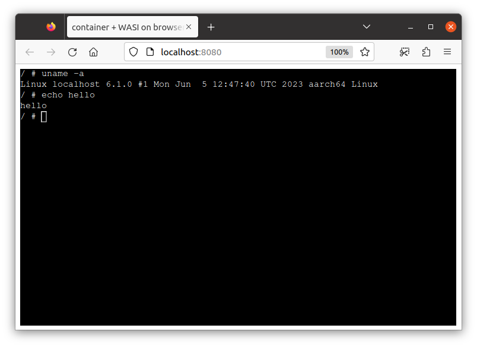

# AArch64 image example



You can use `target-arch` flag to change the target architecture.

> NOTE: As of now, non-x86_64 and  non-riscv64 image is slow because it runs on the additional emulation by QEMU in the guest linux.

## Convert to WASI

```
$ c2w --target-arch=aarch64 alpine:3.17 /tmp/out/out.wasm
```

Run it on the runtime:

```
$ wasmtime /tmp/out/out.wasm echo hello
hello
```

## Run WASI image on browser

The following runs the WASI-converted container image on browser.

> Run this at the project repo root directory.

```
$ c2w --target-arch=aarch64 alpine:3.17 /tmp/out-js2/htdocs/out.wasm
$ cp -R ./examples/wasi-browser/* /tmp/out-js2/ && chmod 755 /tmp/out-js2/htdocs
$ docker run --rm -p 8080:80 \
         -v "/tmp/out-js2/htdocs:/usr/local/apache2/htdocs/:ro" \
         -v "/tmp/out-js2/xterm-pty.conf:/usr/local/apache2/conf/extra/xterm-pty.conf:ro" \
         --entrypoint=/bin/sh httpd -c 'echo "Include conf/extra/xterm-pty.conf" >> /usr/local/apache2/conf/httpd.conf && httpd-foreground'
```

You can run the container on browser via `localhost:8080`.

> Please see [wasi-browser example](../wasi-browser) for details about WASI-on-browser.

## Run on browser using emscripten

`--to-js` provides emscripten-compiled image runnable on browser.

```
$ c2w --to-js --target-arch=aarch64 alpine:3.17 /tmp/aarch64/htdocs/
```

Run it on browser:

> Run this at the project repo root directory.

```
$ cp -R ./examples/emscripten/* /tmp/aarch64/ && chmod 755 /tmp/aarch64/htdocs
$ docker run --rm -p 8080:80 \
         -v "/tmp/aarch64/htdocs:/usr/local/apache2/htdocs/:ro" \
         -v "/tmp/aarch64/xterm-pty.conf:/usr/local/apache2/conf/extra/xterm-pty.conf:ro" \
         --entrypoint=/bin/sh httpd -c 'echo "Include conf/extra/xterm-pty.conf" >> /usr/local/apache2/conf/httpd.conf && httpd-foreground'
```

You can run the container on browser via `localhost:8080`.

> NOTE: It can take some time to load and start the container.
